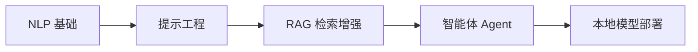

# 🤖 AI Agent 完全指南

欢迎来到 **AI Agent 完全指南** —— 一本面向开发者的 AI 智能体学习教程。

---

## 📚 内容导航

| 部分 | 主题 | 章节数 |
|------|------|--------|
| **第一部分** | NLP 基础 | 4 章 |
| **第二部分** | 面向开发者的提示工程 | 9 章 |
| **第三部分** | RAG 检索增强生成 | 18 章 |
| **第四部分** | 智能体 Agent | 11 章 |
| **第五部分** | 本地模型运行与管理 | 1 章 |

---

## 🎯 学习路线

1. **第一部分 · NLP 基础** —— 从 NLP 基本概念、Transformer 架构到预训练模型和大语言模型
2. **第二部分 · 提示工程** —— 掌握 Prompt Engineering 的核心技巧，包括总结、推断、转换、扩展等
3. **第三部分 · RAG** —— 深入检索增强生成技术：数据加载、向量嵌入、混合检索、查询优化
4. **第四部分 · Agent** —— 构建智能体：从经典范式到低代码平台，从框架开发到上下文工程
5. **第五部分 · 本地部署** —— Ollama 入门到 vLLM 服务化部署实践

---

> 💡 点击左侧导航栏开始学习！
