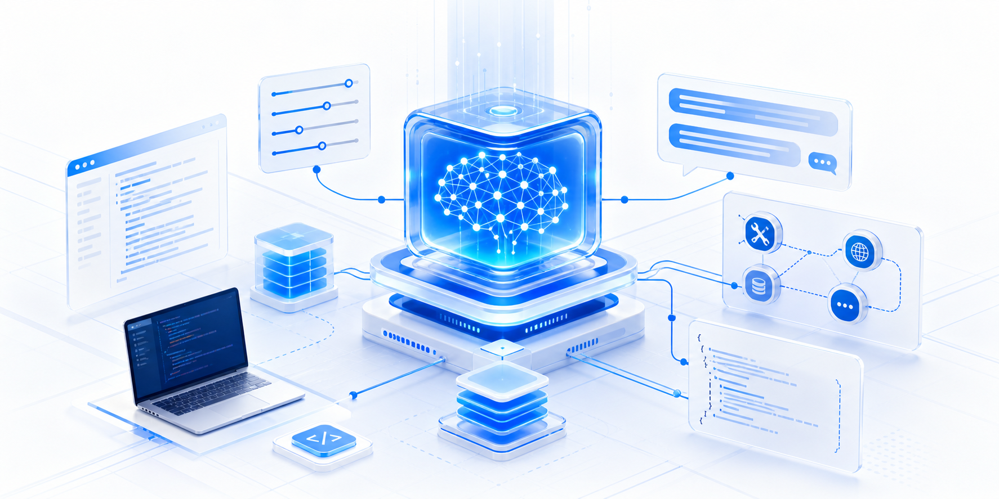

# 第三章 模型调用基础与能力实践

在前面的学习中，我们已经对大模型是什么、能做什么有了初步认识。到了这一章，重点会从“理解模型”转向“使用模型”：如何把一次自然语言请求变成一次标准 API 调用，如何控制模型输出，如何让模型边生成边返回，如何让模型调用工具、复用上下文，并把结果稳定地交给程序处理。

> 💡 **一句话总结**：本章要解决的问题是：从零开始，学会把大模型接入自己的应用，并理解常用能力背后的调用方式。

  
  
图 3-0 模型调用基础与能力实践

## 一、为什么要先学模型调用？

很多入门者第一次使用大模型 API 时，容易把它理解成“给模型发一句话，然后等它回一句话”。这当然是最小用法，但真正进入开发场景后，我们很快会遇到更多问题：

- 回答太随机，能不能更稳定？
- 输出太慢，能不能边生成边展示？
- 问题比较复杂，能不能让模型多想一会儿？
- 模型不知道实时信息，能不能让它调用外部工具？
- 每次都塞很长的系统提示词，成本能不能降下来？
- 返回内容要进数据库或系统流程，能不能保证是合法 JSON？

这些问题共同指向一个核心：**大模型不是一个单独的聊天框，而是一组可以被工程化组合的能力接口**。学会这些接口，才能从“会问模型问题”走向“会把模型做进系统”。

## 二、本章会学习什么？

本章内容按照从基础到进阶的顺序展开，可以理解为一条完整的学习路径。

### 2.1 先掌握一次调用的基本结构

首先需要理解模型调用中最常见的参数，例如 `temperature`、`top_p`、`max_tokens`、`stream`、`thinking` 和 `reasoning_effort`。这些参数决定了模型输出的稳定性、长度、速度和推理深度。

对应阅读：[01_核心参数.md](01_核心参数.md)

### 2.2 再学会用不同方式接入模型

掌握参数之后，就可以学习如何真正发起请求。本章会介绍 HTTP API、Python SDK 与 Java SDK 三种接入方式。对于入门者来说，HTTP API 有助于理解请求本质，SDK 则更适合日常开发。

对应阅读：[02_HTTP API、Python SDK 与 Java SDK.md](02_HTTP%20API、Python%20SDK%20与%20Java%20SDK.md)

### 2.3 理解模型的推理能力如何控制

当任务涉及规划、分析、复杂问答或代码推理时，可以启用深度思考，并通过不同思考模式控制模型如何在多轮、工具调用和编码场景中保持推理连续性。

对应阅读：[03_深度思考.md](03_深度思考.md)、[04_思考模式.md](04_思考模式.md)

### 2.4 学会改善交互体验

在聊天助手、内容生成、代码生成等场景中，如果等待完整结果再展示，用户体验会比较差。流式消息可以让模型一边生成一边返回，显著降低用户感知等待时间。

对应阅读：[05_流式消息.md](05_流式消息.md)

### 2.5 让模型连接外部世界

工具调用是从“聊天模型”走向“智能体应用”的关键一步。通过定义函数、解析参数、执行外部逻辑并把结果返回给模型，模型就可以查询天气、搜索信息、计算数据、访问业务系统，甚至参与复杂工作流。

对应阅读：[06_工具调用.md](06_工具调用.md)

### 2.6 控制成本，并让输出更适合程序处理

上下文缓存可以复用重复的系统提示词、历史对话和长文档内容，降低 Token 消耗与响应延迟。结构化输出则可以要求模型返回 JSON，方便后续进入数据库、接口、表单或自动化流程。

对应阅读：[07_上下文缓存.md](07_上下文缓存.md)、[08_结构化输出.md](08_结构化输出.md)

## 三、以智谱模型为例进行实践

接下来的内容会统一以智谱开放平台和 GLM 系列模型为例说明这些能力的使用方式。选择同一个平台作为示例，是为了让初学者把注意力放在“能力怎么用”和“请求结构怎么组织”上，而不是在不同厂商、不同 SDK、不同参数命名之间来回切换。

在学习过程中，可以重点关注三件事：

1. **请求怎么写**：包括 `model`、`messages`、参数、工具定义和输出格式。
2. **响应怎么看**：包括 `choices`、`delta`、`tool_calls`、`usage` 和缓存命中字段。
3. **能力怎么组合**：例如“深度思考 + 流式输出”、“工具调用 + 交错式思考”、“长上下文 + 缓存 + 结构化输出”。

需要注意的是，本章虽然以智谱模型为例，但这些概念本身具有较强的通用性。掌握之后，再迁移到其他大模型平台时，主要差异通常只是端点、模型名称、SDK 写法和少量参数细节。

## 四、建议学习顺序

如果你是第一次接触大模型 API，建议按下面的顺序学习：

1. 先读“核心参数”，知道每个参数大致控制什么。
2. 再用 HTTP API 或 Python SDK 跑通一次最小调用。
3. 尝试打开 `stream`，观察流式响应和普通响应的区别。
4. 对复杂问题启用 `thinking`，比较开启和关闭后的效果差异。
5. 写一个简单工具函数，让模型完成一次工具调用闭环。
6. 在长提示词或多轮对话中观察缓存命中字段。
7. 最后尝试让模型按 JSON 格式返回结果，并用代码解析。

完成这一章后，你应该能够独立写出一个基础的大模型调用程序，并理解常见能力参数在实际应用中的作用。后续再学习 RAG、智能体、多模态或企业级应用时，这些内容都会成为最基础的“接口语言”。
