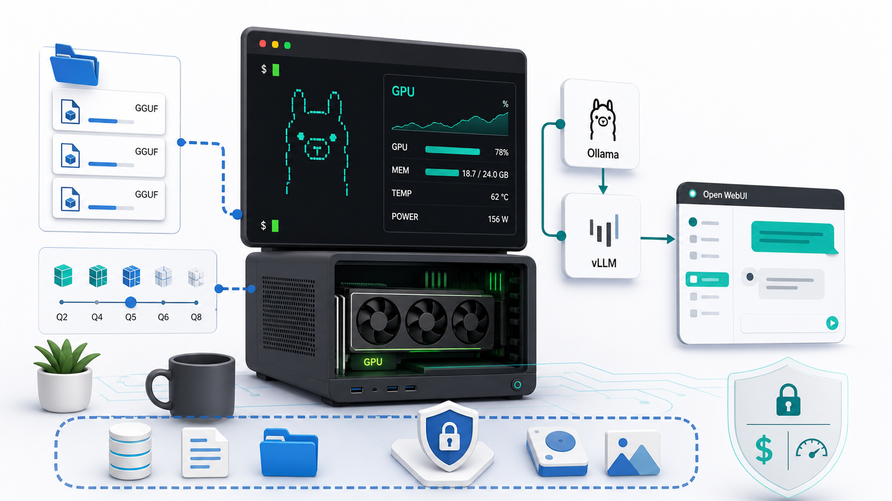
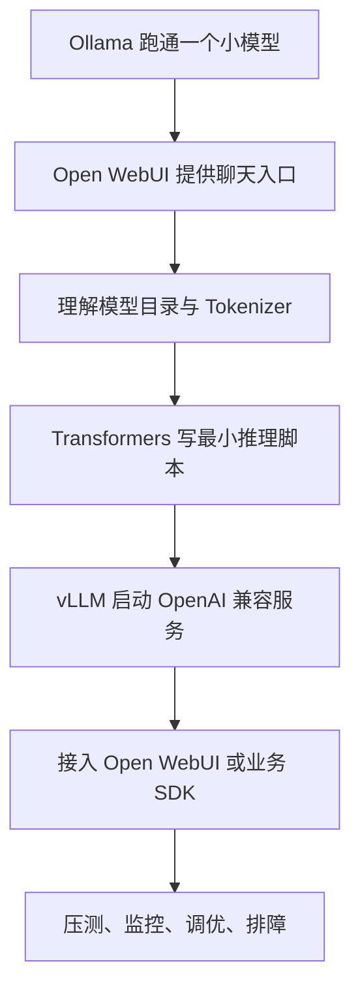
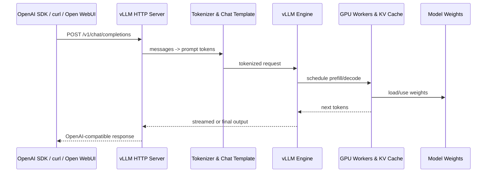
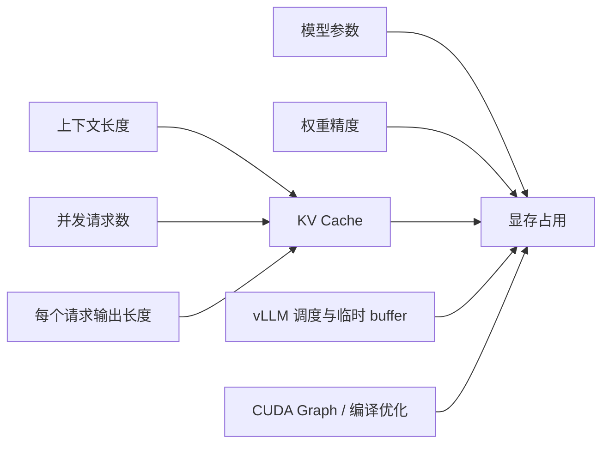
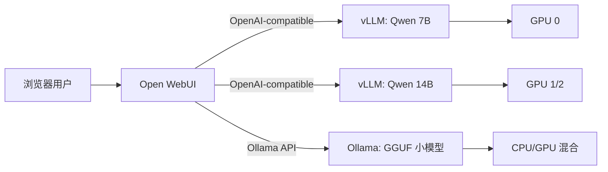
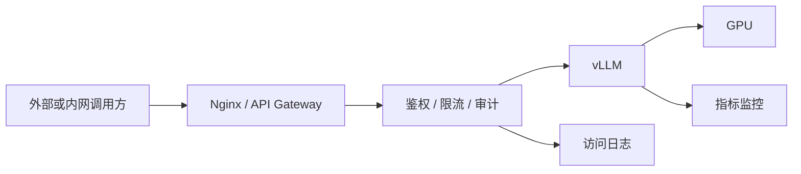

# 第八章 本地模型运行与管理：从 Ollama 入门到 vLLM 服务化部署



本章属于“部署与运行模型”这一部分，默认你已经具备 Linux、Docker、Python 和 GPU 基础：知道如何 SSH 到服务器，能读懂 `nvidia-smi`，理解虚拟环境、端口、容器卷挂载和基础网络配置。我们不会把本地大模型部署讲成“复制一行命令就万事大吉”，而是把它拆成一套可维护的系统：模型从哪里来、文件代表什么、推理框架如何加载它、显存为什么会爆、服务如何暴露给应用、监控和排障应该看哪里。

这一章会先用 Ollama 和 Open WebUI 建立直观体验，再把重点放在 vLLM。原因很简单：Ollama 适合个人快速上手，Open WebUI 适合给人一个统一聊天入口，而 vLLM 更接近“把模型变成可被业务系统调用的推理服务”。当你需要 OpenAI 兼容 API、高吞吐、多用户并发、多 GPU、可调的 KV Cache 和生产化运维能力时，vLLM 往往是必须认真掌握的工具。

本章参考了 vLLM、Ollama、Open WebUI、Hugging Face、ModelScope、llama.cpp、MLX 和 Datawhale self-llm 等官方或项目资料。由于推理框架更新很快，具体参数和镜像版本请以文末官方文档为准；本文更强调理解路径和工程判断。

## 本章学习目标

学完本章，你应该能做到：

1. 判断一个场景是否适合本地运行模型，而不是被“本地免费”这种口号带偏。
2. 搭建并检查基本环境：Linux、NVIDIA 驱动、CUDA、PyTorch、Docker、NVIDIA Container Toolkit 和 GPU 状态。
3. 理解模型目录中的 `config.json`、Tokenizer、权重文件、`generation_config.json`、架构代码和聊天模板。
4. 区分 Safetensors、GGUF、GPTQ、AWQ 等格式的适用场景。
5. 使用 Ollama 快速运行模型，并用 Open WebUI 提供对话入口。
6. 使用 vLLM 通过 Python 或 Docker 部署 OpenAI 兼容服务。
7. 解释参数量、精度、KV Cache、上下文长度、并发数和显存占用之间的关系。
8. 根据业务目标选择 FP16、BF16、INT8、INT4、AWQ、GPTQ 或 GGUF，而不是盲目追大模型。
9. 对 vLLM 服务做基础压测、监控、调优和排障。

## 8.1 本地运行的价值与限制

### 8.1.1 本地运行到底解决什么问题

本地运行大模型的第一个价值是**数据本地化**。在很多组织里，提示词不是简单聊天，而是包含内部制度、客户资料、源代码、日志、合同、财务表格、研发文档和未公开项目方案。即使云模型服务本身合规，组织也可能因为数据分级、审计、监管或客户合同要求，不能把这些内容发送到外部服务。本地推理可以把模型和数据都留在内网，减少数据出域风险。

第二个价值是**离线使用**。有些环境没有稳定公网，例如实验室、内网服务器、保密机房、工厂现场、离线教学环境和边缘设备。本地模型虽然不一定最强，但只要部署稳定，就可以在没有外部 API 的情况下持续工作。

第三个价值是**控制能力**。使用云 API 时，你控制的是输入、部分参数和应用层逻辑；本地部署时，你还能控制模型版本、权重格式、推理框架、精度、上下文长度、批处理策略、日志保留、鉴权方式、升级节奏和硬件资源。对需要做模型评测、私有化交付、行业适配或成本优化的团队来说，这种控制能力非常重要。

第四个价值是**成本结构可控**。如果调用量很大、请求比较稳定、模型规模适中、团队有 GPU 资源和运维能力，本地部署可能比长期调用商业 API 更可控。但“可能”不是“必然”。本地模型的成本不只是显卡价格，还包括：

- GPU 折旧和闲置成本。
- 电费、散热、机房、云 GPU 租赁成本。
- 驱动、CUDA、依赖、容器、模型版本升级成本。
- 监控、告警、日志、权限、安全加固成本。
- 工程师定位性能问题和显存问题的时间成本。
- 模型质量不够时带来的业务返工成本。

所以，本地部署的正确心态不是“省钱”，而是“在数据、控制、吞吐、延迟和成本之间做可解释的权衡”。

### 8.1.2 本地运行不适合什么场景

本地运行并不适合所有人。下面几类场景应该谨慎：

- 调用量很小，只是偶尔问答。此时云 API 的综合成本通常更低。
- 对最强推理、复杂工具调用、多模态能力有强依赖。本地开源模型可能追不上领先闭源模型。
- 团队没有 GPU 运维能力，却希望部署后长期无人维护。
- 对延迟、可用性、安全审计要求很高，但没有监控和故障恢复方案。
- 业务提示词变化快，没有评测集，只凭主观感觉判断模型好坏。

很多新手会先问：“我这张显卡能不能跑某某模型？”更成熟的问题应该是：

- 要服务多少用户？
- 平均输入多长，平均输出多长？
- 峰值并发是多少？
- 能接受多久首 token 延迟？
- 要不要流式输出？
- 有没有长上下文需求？
- 质量下降多少可接受？
- 是否需要审计和权限隔离？

模型部署是系统工程，不是下载权重。

### 8.1.3 本地模型运行的典型架构

```mermaid
flowchart LR
  U[用户或业务系统] --> UI[Open WebUI / 自研前端 / SDK]
  UI --> GW[API 网关 / 鉴权 / 限流]
  GW --> V[vLLM OpenAI-Compatible Server]
  V --> M[模型权重与 Tokenizer]
  V --> GPU[NVIDIA GPU / KV Cache]
  RAG[向量库 / 文档库 / 工具服务] --> UI
  LOG[日志 / 监控 / 告警] <-- V
  LOG <-- GW
```

个人电脑上，你可以只运行 Ollama；团队环境里，通常会逐步演化为：前端或业务系统调用 OpenAI 兼容接口，后面是 vLLM 服务，再后面是模型文件、GPU、监控、日志和权限控制。Open WebUI 可以作为人类用户的统一入口，也可以连接 Ollama、vLLM 和其他 OpenAI 兼容服务。

## 8.2 环境与模型管理

### 8.2.1 基础环境检查

部署大模型前，先做环境盘点。不要等到 `CUDA out of memory` 才开始怀疑驱动、CUDA 或容器配置。

```bash
uname -a
lsb_release -a || cat /etc/os-release
whoami
df -h
free -h
```

检查 NVIDIA GPU：

```bash
nvidia-smi
nvidia-smi -L
nvidia-smi topo -m
```

`nvidia-smi` 主要看：

- GPU 型号，例如 RTX 4090、L40S、A100、H100。
- 显存容量和当前占用。
- Driver Version。
- CUDA Version，这里显示的是驱动支持的 CUDA 运行时上限，不等于你安装的 CUDA Toolkit 版本。
- 是否已有其他进程占用显存。
- 多卡机器上 GPU 之间的拓扑关系。

检查 CUDA Toolkit：

```bash
nvcc --version
```

检查 Python：

```bash
python3 --version
python3 -m pip --version
```

检查 PyTorch 是否能访问 GPU：

```bash
python3 - <<'PY'
import torch

print("torch:", torch.__version__)
print("cuda available:", torch.cuda.is_available())
print("cuda version:", torch.version.cuda)
print("device count:", torch.cuda.device_count())

for i in range(torch.cuda.device_count()):
    print(i, torch.cuda.get_device_name(i))
PY
```

检查 Docker 和 GPU 容器能力：

```bash
docker --version
docker compose version

docker run --rm --gpus all nvidia/cuda:12.4.1-base-ubuntu22.04 nvidia-smi
```

如果最后一条命令无法在容器内看到 GPU，通常不是 vLLM 的问题，而是 Docker、NVIDIA Container Toolkit 或宿主机驱动配置问题。

### 8.2.2 推荐目录结构

本地模型部署最怕“东西都放在一起”。建议一开始就把模型、配置、日志和服务编排分开：

```text
/data/llm/
  models/
    Qwen/
    DeepSeek/
    Llama/
  cache/
    huggingface/
    modelscope/
  services/
    vllm-qwen7b/
      docker-compose.yml
      .env
      README.md
    open-webui/
      docker-compose.yml
  logs/
    vllm/
  evals/
    prompts.jsonl
    results/
```

这不是形式主义。清晰目录能让你知道：

- 模型文件是否重复下载。
- 哪个服务使用哪个模型版本。
- `.env` 中是否混入了 token。
- 日志和评测结果在哪里。
- 将来迁移服务器时需要复制哪些目录。

### 8.2.3 从 Hugging Face 获取模型

Hugging Face Hub 是开源模型最常见的发布入口。官方 `huggingface_hub` 提供两种常用下载方式：`hf_hub_download` 适合下载单个文件，`snapshot_download` 适合下载整个仓库快照。

安装：

```bash
python3 -m pip install -U huggingface_hub
```

登录：

```bash
huggingface-cli login
```

下载整个模型仓库：

```python
from huggingface_hub import snapshot_download

snapshot_download(
    repo_id="Qwen/Qwen2.5-7B-Instruct",
    local_dir="/data/llm/models/Qwen/Qwen2.5-7B-Instruct",
    local_dir_use_symlinks=False,
)
```

如果只想下载 Safetensors 和配置，可以使用过滤：

```python
from huggingface_hub import snapshot_download

snapshot_download(
    repo_id="Qwen/Qwen2.5-7B-Instruct",
    local_dir="/data/llm/models/Qwen/Qwen2.5-7B-Instruct",
    allow_patterns=[
        "*.json",
        "*.safetensors",
        "*.model",
        "*.txt",
        "*.py",
    ],
    ignore_patterns=[
        "*.bin",
        "*.onnx",
        "*.msgpack",
    ],
)
```

生产环境建议固定 revision：

```python
snapshot_download(
    repo_id="Qwen/Qwen2.5-7B-Instruct",
    revision="main",
    local_dir="/data/llm/models/Qwen/Qwen2.5-7B-Instruct",
)
```

更严格的做法是固定到 commit hash。这样你将来回滚时，不会因为模型仓库更新导致同名模型行为变化。

### 8.2.4 从 ModelScope 获取模型

国内网络环境下，ModelScope 常用于模型下载和镜像分发。典型方式是使用 ModelScope SDK：

```bash
python3 -m pip install -U modelscope
```

```python
from modelscope import snapshot_download

snapshot_download(
    model_id="Qwen/Qwen2.5-7B-Instruct",
    cache_dir="/data/llm/cache/modelscope",
)
```

ModelScope、Hugging Face 和模型官方仓库之间可能存在文件命名、版本更新节奏和模型说明差异。部署时要记录来源、下载日期、commit 或版本号，尤其不要把两个来源下载的同名目录混在一起。

### 8.2.5 模型目录里都是什么

一个 Transformers 生态常见模型目录大概如下：

```text
Qwen2.5-7B-Instruct/
  README.md
  config.json
  generation_config.json
  tokenizer.json
  tokenizer_config.json
  special_tokens_map.json
  merges.txt
  vocab.json
  model-00001-of-00004.safetensors
  model-00002-of-00004.safetensors
  model-00003-of-00004.safetensors
  model-00004-of-00004.safetensors
  model.safetensors.index.json
```

这些文件的职责如下：

| 文件或对象 | 作用 | 部署时关注点 |
| --- | --- | --- |
| `README.md` | 模型卡，说明模型能力、许可证、上下文长度、推荐参数 | 是否允许商用，是否需要特殊依赖 |
| `config.json` | 模型结构配置，例如隐藏维度、层数、注意力头数、模型类型 | 推理框架是否支持该架构 |
| Tokenizer 文件 | 将文本切分为 token，处理特殊 token 和聊天模板 | 模板错误会导致模型答非所问 |
| `generation_config.json` | 默认生成参数，如温度、采样、最大生成长度 | vLLM 等框架可能读取并影响默认行为 |
| `.safetensors` | 模型权重，可能单文件也可能多分片 | 分片是否完整，索引是否匹配 |
| `.py` 架构代码 | 某些模型需要自定义模型代码 | 是否需要 `trust_remote_code` |

### 8.2.6 Tokenizer 和聊天模板为什么重要

很多部署问题看起来像“模型不聪明”，其实是聊天模板没对上。Chat 模型训练时通常约定了用户、助手、系统提示的格式。如果你把 Chat 模型当普通续写模型调用，或者用了错误模板，模型可能会：

- 重复输出用户问题。
- 不遵守系统提示。
- 输出特殊 token。
- 多轮对话记忆混乱。
- 对工具调用格式理解错误。

Transformers 中常见写法是：

```python
from transformers import AutoTokenizer

tokenizer = AutoTokenizer.from_pretrained(
    "/data/llm/models/Qwen/Qwen2.5-7B-Instruct",
    trust_remote_code=True,
)

messages = [
    {"role": "system", "content": "你是一个严谨的部署助手。"},
    {"role": "user", "content": "解释 vLLM 的作用。"},
]

prompt = tokenizer.apply_chat_template(
    messages,
    tokenize=False,
    add_generation_prompt=True,
)

print(prompt)
```

在 vLLM 的 `/v1/chat/completions` 接口中，服务端会根据模型 Tokenizer 和聊天模板处理消息。若模型没有内置模板，可能需要显式指定 `--chat-template`。这类问题在换模型时尤其常见。

### 8.2.7 Generation Config 不只是“默认参数”

`generation_config.json` 可能包含：

- `temperature`
- `top_p`
- `top_k`
- `repetition_penalty`
- `max_new_tokens`
- `eos_token_id`
- `pad_token_id`

这些参数会影响输出风格。vLLM 官方快速开始文档提醒，服务可能读取模型仓库中的 `generation_config.json`，这意味着同一段请求在不同模型目录或不同框架下默认行为不一定一致。做评测时，最好显式指定关键参数：

```bash
curl http://127.0.0.1:8000/v1/chat/completions \
  -H "Content-Type: application/json" \
  -H "Authorization: Bearer token-abc123" \
  -d '{
    "model": "qwen2.5-7b-instruct",
    "messages": [
      {"role": "user", "content": "用三句话解释 KV Cache。"}
    ],
    "temperature": 0.3,
    "top_p": 0.9,
    "max_tokens": 512
  }'
```

### 8.2.8 常见权重和量化格式

| 格式 | 常见生态 | 适用场景 | 注意点 |
| --- | --- | --- | --- |
| Safetensors | Transformers、vLLM、TGI 等 | GPU 推理、训练后权重分发、服务化部署 | 通用性强，但显存需求取决于精度 |
| GGUF | llama.cpp、Ollama | CPU、Apple Silicon、低资源设备、单文件分发 | 通常不用于 vLLM 主路径 |
| GPTQ | AutoGPTQ、ExLlama、部分 vLLM 场景 | GPU 上的 4bit/8bit 权重量化 | 模型和框架兼容性要实测 |
| AWQ | AutoAWQ、vLLM 等 | 权重量化部署，常用于降低显存 | 不同模型质量变化不同 |
| FP16/BF16 | 主流 GPU 推理 | 质量稳定、兼容性好 | 显存占用较高 |

新手最容易犯的错误是把“文件格式”与“推理框架”混为一谈。GGUF 很适合 llama.cpp 和 Ollama，但不是 vLLM 的核心路径；Safetensors 适合 vLLM，但如果模型太大，仍然需要多卡、量化或降低上下文/并发。

## 8.3 本地推理工具总览

### 8.3.1 工具定位表

| 工具 | 主要定位 | 适合谁 | 不适合谁 |
| --- | --- | --- | --- |
| Ollama | 快速下载、运行和本地 API 调用 | 个人学习、桌面使用、快速试模型 | 高并发生产服务 |
| Open WebUI | 统一对话界面、模型和用户管理 | 团队聊天入口、模型聚合、轻量 RAG | 纯后端高性能推理 |
| llama.cpp | CPU、GGUF、低资源和边缘设备 | 没有大 GPU、需要单文件模型的人 | 追求高吞吐 GPU 服务的人 |
| MLX | Apple Silicon 环境 | Mac 本地模型实验 | NVIDIA GPU 服务化部署 |
| Transformers | 开发研究和自定义推理流程 | 研究、调试、模型加载实验 | 直接承载高并发 API |
| vLLM | 高吞吐服务化推理、OpenAI 兼容 API | 需要部署模型服务的工程团队 | 只想点开聊天窗口的个人用户 |

### 8.3.2 学习路线建议

最稳妥的学习路线是：



Ollama 解决“先跑起来”；Transformers 解决“理解模型如何被加载”；vLLM 解决“如何作为服务稳定承载请求”。不要跳过中间环节，否则排障时会不知道问题发生在模型、Tokenizer、框架、容器、GPU 还是 API 层。

## 8.4 Ollama：快速运行模型

### 8.4.1 安装与启动

Linux 上常见安装方式：

```bash
curl -fsSL https://ollama.com/install.sh | sh
```

确认服务：

```bash
ollama --version
ollama list
```

下载并运行模型：

```bash
ollama pull qwen3
ollama run qwen3
```

查看当前加载模型：

```bash
ollama ps
```

停止模型：

```bash
ollama stop qwen3
```

Ollama 默认提供本地 API。你可以用：

```bash
curl http://127.0.0.1:11434/api/generate -d '{
  "model": "qwen3",
  "prompt": "解释为什么本地部署不一定更便宜。"
}'
```

也可以使用聊天接口：

```bash
curl http://127.0.0.1:11434/api/chat -d '{
  "model": "qwen3",
  "messages": [
    {"role": "system", "content": "你是一个本地模型部署助教。"},
    {"role": "user", "content": "列出部署前要检查的 GPU 项目。"}
  ]
}'
```

### 8.4.2 Modelfile

`Modelfile` 可以理解为 Ollama 模型的本地封装配置，常用于指定基础模型、系统提示和参数。

```text
FROM qwen3

SYSTEM """
你是一个严谨的本地大模型部署助教。
回答问题时先给结论，再给步骤，最后给排障建议。
"""

PARAMETER temperature 0.3
PARAMETER top_p 0.9
PARAMETER num_ctx 4096
```

创建模型：

```bash
ollama create local-deploy-helper -f Modelfile
ollama run local-deploy-helper
```

Ollama 的优点是快，缺点是服务化调优能力有限。如果你需要清晰控制 GPU 显存比例、批处理、并发、长上下文、OpenAI 兼容接口和多卡扩展，后面应该切到 vLLM。

## 8.5 Open WebUI：统一对话入口

Open WebUI 的定位不是推理引擎，而是用户入口和模型管理界面。它可以连接 Ollama，也可以连接 OpenAI 兼容接口，因此也可以连接 vLLM。

### 8.5.1 Docker 启动

如果 Ollama 跑在宿主机：

```bash
docker run -d \
  -p 3000:8080 \
  --add-host=host.docker.internal:host-gateway \
  -v open-webui:/app/backend/data \
  --name open-webui \
  --restart always \
  ghcr.io/open-webui/open-webui:main
```

浏览器访问：

```text
http://localhost:3000
```

如果使用支持 CUDA 的 Open WebUI 镜像或内置能力，请以官方文档当前推荐为准。对多数入门场景，Open WebUI 作为前端连接已有 Ollama 或 vLLM 服务即可。

### 8.5.2 连接 vLLM

vLLM 提供 OpenAI 兼容接口后，可以在 Open WebUI 里添加 OpenAI-compatible provider：

```text
Base URL: http://vllm-server:8000/v1
API Key: 你启动 vLLM 时设置的 token
Model: qwen2.5-7b-instruct
```

如果 Open WebUI 和 vLLM 都在 Docker Compose 中，建议放到同一个网络，通过服务名访问：

```text
http://vllm:8000/v1
```

如果 Open WebUI 在容器内，vLLM 在宿主机上，Linux 下可以使用 host-gateway：

```yaml
extra_hosts:
  - "host.docker.internal:host-gateway"
```

## 8.6 vLLM：从本地命令到推理服务

### 8.6.1 vLLM 适合解决什么

vLLM 是一个高吞吐、内存效率较高的 LLM 推理和服务框架。它的核心价值不是“也能跑模型”，而是：

- 提供 OpenAI 兼容服务，方便应用迁移。
- 用连续批处理提升多请求吞吐。
- 更高效管理 KV Cache。
- 支持多种模型、精度和量化方式。
- 支持 tensor parallel、pipeline parallel 等扩展方式。
- 提供一组可调的引擎参数，方便围绕显存、吞吐和延迟做权衡。

如果你的目标是“我自己在电脑上聊一聊”，Ollama 更轻；如果你的目标是“让多个用户或业务系统稳定调用一个模型服务”，vLLM 更值得投入。

### 8.6.2 vLLM 的请求路径



这个路径能帮你定位问题：

- 404 或认证失败，多半在 API 层。
- 输出格式怪，多半在 Tokenizer 或聊天模板。
- 显存爆，多半在权重、KV Cache、上下文或并发。
- 首 token 慢，可能是 prefill 太长、模型太大、批处理拥塞或冷启动。
- TPS 低，可能是硬件、量化、并发策略、上下文长度或采样配置问题。

### 8.6.3 Python 安装方式

在干净环境中安装：

```bash
python3 -m venv .venv
source .venv/bin/activate
python -m pip install -U pip
python -m pip install vllm
```

启动一个模型：

```bash
vllm serve Qwen/Qwen2.5-7B-Instruct \
  --host 0.0.0.0 \
  --port 8000 \
  --dtype auto
```

如果模型需要访问 Hugging Face gated repo，需要先登录或设置 token：

```bash
export HF_TOKEN="hf_xxx"
```

给模型一个对外名称：

```bash
vllm serve /data/llm/models/Qwen/Qwen2.5-7B-Instruct \
  --served-model-name qwen2.5-7b-instruct \
  --host 0.0.0.0 \
  --port 8000 \
  --dtype auto
```

此时客户端请求中的 `model` 可以写 `qwen2.5-7b-instruct`。

### 8.6.4 Docker 启动方式

vLLM 官方提供 `vllm/vllm-openai` Docker 镜像，用于运行 OpenAI 兼容服务器。典型命令：

```bash
docker run --runtime nvidia --gpus all \
  -v ~/.cache/huggingface:/root/.cache/huggingface \
  --env "HF_TOKEN=$HF_TOKEN" \
  -p 8000:8000 \
  --ipc=host \
  vllm/vllm-openai:latest \
  --model Qwen/Qwen2.5-7B-Instruct \
  --served-model-name qwen2.5-7b-instruct \
  --dtype auto
```

几个参数要理解：

- `--gpus all`：把宿主机 GPU 暴露给容器。
- `--ipc=host`：减少共享内存相关问题，官方 Docker 示例也使用该参数。
- `-v ~/.cache/huggingface:/root/.cache/huggingface`：复用 Hugging Face 缓存，避免重复下载。
- `--env "HF_TOKEN=$HF_TOKEN"`：让容器能访问需要授权的模型。
- `--model`：模型名或本地路径。
- `--served-model-name`：对外暴露的模型名。

如果模型已经下载到本地：

```bash
docker run --runtime nvidia --gpus all \
  -v /data/llm/models:/models \
  -p 8000:8000 \
  --ipc=host \
  vllm/vllm-openai:latest \
  --model /models/Qwen/Qwen2.5-7B-Instruct \
  --served-model-name qwen2.5-7b-instruct \
  --dtype auto
```

### 8.6.5 Docker Compose 示例

长期运行建议使用 Compose：

```yaml
services:
  vllm:
    image: vllm/vllm-openai:latest
    container_name: vllm-qwen
    restart: unless-stopped
    ports:
      - "8000:8000"
    ipc: host
    environment:
      HF_TOKEN: ${HF_TOKEN}
    volumes:
      - /data/llm/models:/models
      - /data/llm/cache/huggingface:/root/.cache/huggingface
    deploy:
      resources:
        reservations:
          devices:
            - driver: nvidia
              count: all
              capabilities: [gpu]
    command:
      - --model
      - /models/Qwen/Qwen2.5-7B-Instruct
      - --served-model-name
      - qwen2.5-7b-instruct
      - --host
      - 0.0.0.0
      - --port
      - "8000"
      - --dtype
      - auto
      - --gpu-memory-utilization
      - "0.90"
      - --max-model-len
      - "8192"
      - --api-key
      - ${VLLM_API_KEY}
```

`.env`：

```bash
HF_TOKEN=hf_xxx
VLLM_API_KEY=change-me
```

启动：

```bash
docker compose up -d
docker logs -f vllm-qwen
```

### 8.6.6 验证 OpenAI 兼容接口

查询模型：

```bash
curl http://127.0.0.1:8000/v1/models \
  -H "Authorization: Bearer change-me"
```

聊天请求：

```bash
curl http://127.0.0.1:8000/v1/chat/completions \
  -H "Content-Type: application/json" \
  -H "Authorization: Bearer change-me" \
  -d '{
    "model": "qwen2.5-7b-instruct",
    "messages": [
      {"role": "system", "content": "你是一个本地模型部署助教。"},
      {"role": "user", "content": "用列表说明 vLLM 部署前要检查什么。"}
    ],
    "temperature": 0.3,
    "max_tokens": 512
  }'
```

流式输出：

```bash
curl http://127.0.0.1:8000/v1/chat/completions \
  -H "Content-Type: application/json" \
  -H "Authorization: Bearer change-me" \
  -d '{
    "model": "qwen2.5-7b-instruct",
    "stream": true,
    "messages": [
      {"role": "user", "content": "解释 PagedAttention 和 KV Cache 的关系。"}
    ]
  }'
```

Python SDK 调用：

```python
from openai import OpenAI

client = OpenAI(
    base_url="http://127.0.0.1:8000/v1",
    api_key="change-me",
)

response = client.chat.completions.create(
    model="qwen2.5-7b-instruct",
    messages=[
        {"role": "user", "content": "给我一个 vLLM Docker 部署检查清单。"}
    ],
    temperature=0.3,
)

print(response.choices[0].message.content)
```

### 8.6.7 离线推理方式

vLLM 不只是服务，也可以在 Python 中做离线批量推理：

```python
from vllm import LLM, SamplingParams

llm = LLM(
    model="/data/llm/models/Qwen/Qwen2.5-7B-Instruct",
    dtype="auto",
    max_model_len=8192,
)

sampling = SamplingParams(
    temperature=0.3,
    top_p=0.9,
    max_tokens=512,
)

prompts = [
    "解释本地部署模型的优缺点。",
    "列出 vLLM 服务化部署的关键参数。",
]

outputs = llm.generate(prompts, sampling)

for output in outputs:
    print(output.prompt)
    print(output.outputs[0].text)
```

离线推理适合：

- 批量评测。
- 数据生成。
- 回归测试。
- 对比不同模型或量化版本。

在线服务适合：

- 多用户聊天。
- 业务系统调用。
- Open WebUI 接入。
- 需要统一 API 的场景。

## 8.7 vLLM 核心参数与调优

### 8.7.1 常用启动参数

| 参数 | 作用 | 常见取值或建议 |
| --- | --- | --- |
| `--model` | 模型名称或本地路径 | Hugging Face repo id 或 `/models/...` |
| `--served-model-name` | 对外暴露模型名 | 建议短而稳定 |
| `--host` | 监听地址 | 容器中通常 `0.0.0.0` |
| `--port` | 监听端口 | 常见 `8000` |
| `--dtype` | 权重和计算精度 | `auto`、`float16`、`bfloat16` |
| `--gpu-memory-utilization` | vLLM 可使用的 GPU 显存比例 | 默认值会随版本变化，以官方文档为准；常从 `0.85` 到 `0.92` 调 |
| `--max-model-len` | 最大上下文长度 | 根据业务和显存设置 |
| `--max-num-seqs` | 每轮调度最多序列数 | 降低可减少并发显存压力 |
| `--max-num-batched-tokens` | 每轮批处理 token 上限 | 影响吞吐和显存 |
| `--tensor-parallel-size` | 张量并行 GPU 数 | 大模型多卡常用 |
| `--pipeline-parallel-size` | 流水线并行阶段数 | 多节点或超大模型可能用 |
| `--quantization` | 指定量化方式 | 依模型格式和 vLLM 支持情况而定 |
| `--api-key` | API 鉴权 token | 不要裸奔到公网 |
| `--trust-remote-code` | 信任模型仓库自定义代码 | 只对可信模型开启 |

不要一开始就把参数调满。建议从简单稳定配置开始：

```bash
vllm serve /models/Qwen/Qwen2.5-7B-Instruct \
  --served-model-name qwen2.5-7b-instruct \
  --host 0.0.0.0 \
  --port 8000 \
  --dtype auto \
  --max-model-len 8192 \
  --gpu-memory-utilization 0.90 \
  --api-key change-me
```

确认稳定后，再逐步调大上下文、并发或批处理参数。

### 8.7.2 `gpu_memory_utilization` 的正确理解

vLLM 会为模型执行器使用一定比例的 GPU 显存，并预分配 KV Cache。官方文档说明，`gpu_memory_utilization` 表示当前 vLLM 实例可使用的 GPU 显存比例，是每个实例的限制。它不是“实际业务请求已经用掉多少显存”的实时指标。

这会造成一个常见困惑：服务刚启动、还没有用户请求，`nvidia-smi` 已经显示显存占用很高。原因是 vLLM 提前预留了缓存空间，目的是减少运行时碎片和调度不确定性。

调参建议：

- OOM 发生在启动阶段：降低 `gpu_memory_utilization`、降低 `max_model_len`、换更小模型或量化模型。
- 请求中频繁出现抢占或重计算：可以尝试提高 `gpu_memory_utilization`，或降低 `max_num_seqs` / `max_num_batched_tokens`。
- 同一 GPU 上跑多个 vLLM 实例：分别设置较低的 `gpu_memory_utilization`，避免互相挤爆。
- 不要把它设置到 1.0。系统、驱动、CUDA Graph、临时 buffer 和其他进程都需要空间。

### 8.7.3 上下文长度与 KV Cache

KV Cache 是推理显存的重要来源。模型生成时，每个 token 都会产生注意力的 key/value 缓存。上下文越长、并发越高，KV Cache 越大。



这解释了为什么“7B 模型能跑”不等于“7B 模型能服务多人 32K 上下文”。权重只是基础占用；长上下文和并发请求会迅速吃掉剩余显存。

### 8.7.4 首 token 延迟与吞吐

推理一般分为两个阶段：

- Prefill：处理输入 prompt，把上下文送进模型。
- Decode：逐 token 生成输出。

长 prompt 会拉高 prefill 成本；长输出会拉高 decode 总时间。对聊天产品而言，用户体感最敏感的是首 token 延迟；对批处理任务而言，更关心总吞吐和单位成本。

优化时要先定义目标：

| 目标 | 优先看什么 | 常见优化方向 |
| --- | --- | --- |
| 聊天体感 | TTFT、流式输出稳定性 | 控制 prompt 长度，减少排队，合理并发 |
| 批处理 | tokens/s、总完成时间 | 提高批处理利用率，增大并发，离线推理 |
| 长文档问答 | 上下文长度、OOM、检索质量 | RAG 切分，限制上下文，降低并发 |
| API 服务 | P95/P99 延迟、错误率 | 限流、队列、监控、水平扩展 |

### 8.7.5 多 GPU：tensor parallel 与 pipeline parallel

如果模型权重无法放进单卡，或吞吐目标超过单卡能力，就要考虑多 GPU。vLLM 支持 tensor parallel 和 pipeline parallel。

单机多卡张量并行示例：

```bash
vllm serve /models/Qwen/Qwen2.5-72B-Instruct \
  --served-model-name qwen2.5-72b-instruct \
  --tensor-parallel-size 4 \
  --dtype auto \
  --max-model-len 8192 \
  --host 0.0.0.0 \
  --port 8000
```

理解要点：

- `--tensor-parallel-size 4` 表示模型张量切到 4 张 GPU 上。
- 多卡通信成本很重要，NVLink 通常优于普通 PCIe。
- 不要只看总显存，例如 4 张 24GB 不等于一张 96GB，通信和切分策略会影响性能。
- 多卡部署前先看 `nvidia-smi topo -m`。

pipeline parallel 更适合模型很大或跨节点场景，但会增加调度复杂度。入门阶段优先掌握单机单卡、单机多卡 tensor parallel。

### 8.7.6 vLLM 与 Open WebUI 组合

一种实用组合是：



这样可以把模型分层：

- 小模型：快速响应、低成本、做简单问答。
- 中模型：日常助理、代码解释、文档总结。
- 大模型：复杂推理、重要任务、低并发高质量。

Open WebUI 管人、会话和入口；vLLM 管高性能推理；Ollama 保留本地快速实验能力。

## 8.8 资源估算与量化

### 8.8.1 显存估算的基本公式

粗略估算权重显存：

```text
权重显存 ≈ 参数量 × 每个参数字节数

FP32: 4 bytes
FP16/BF16: 2 bytes
INT8: 1 byte
INT4: 0.5 byte
```

例如：

| 模型规模 | FP16/BF16 权重粗略占用 | INT8 粗略占用 | INT4 粗略占用 |
| --- | ---: | ---: | ---: |
| 3B | 6GB | 3GB | 1.5GB |
| 7B | 14GB | 7GB | 3.5GB |
| 14B | 28GB | 14GB | 7GB |
| 32B | 64GB | 32GB | 16GB |
| 72B | 144GB | 72GB | 36GB |

这只是权重占用，不包含 KV Cache、CUDA Graph、临时 buffer、框架开销和系统保留显存。实际部署时，你需要留出明显余量。

### 8.8.2 为什么上下文长度会吞显存

上下文长度对显存的影响主要来自 KV Cache。对于同一个模型：

- `max_model_len=4096` 比 `8192` 更省显存。
- 1 个并发请求比 16 个并发请求更省显存。
- 长输入和长输出都会增加缓存压力。

所以，业务上经常要做选择：

| 选择 | 好处 | 代价 |
| --- | --- | --- |
| 降低 `max_model_len` | 降低 KV Cache 上限，减少 OOM | 长文档任务受限 |
| 降低 `max_num_seqs` | 降低并发显存压力 | 高峰期排队变多 |
| 降低输出上限 | 控制 decode 时间和缓存增长 | 回答可能不完整 |
| 使用 RAG 摘要 | 减少直接塞长上下文 | 检索和切分质量变关键 |
| 换量化模型 | 降低权重显存 | 质量和速度需评测 |

### 8.8.3 FP16、BF16、INT8、INT4

| 精度 | 优点 | 风险 | 建议 |
| --- | --- | --- | --- |
| FP16 | 通用、速度快、显存比 FP32 低 | 某些模型数值稳定性不如 BF16 | 消费级 GPU 常用 |
| BF16 | 数值范围更好，训练和推理都常见 | 旧 GPU 支持不如 FP16 | A100/H100/L40S 等优先考虑 |
| INT8 | 显存下降明显，质量通常较稳 | 框架和模型兼容性不同 | 中等显存压力时尝试 |
| INT4 | 显存大幅下降 | 质量下降、速度不一定更快 | 显存紧张或本地实验常用 |

量化不是免费午餐。它降低权重占用，但可能带来：

- 回答质量下降。
- 数学、代码、长上下文能力下降。
- 某些任务幻觉增加。
- 特定 GPU 上速度反而不理想。
- 框架参数和模型格式兼容问题。

因此，量化模型一定要拿自己的任务评测，而不是只看别人排行榜。

### 8.8.4 AWQ 和 GPTQ 在 vLLM 中的位置

AWQ 和 GPTQ 都常用于权重量化。它们的价值是把更大模型放进较小显存，或在相同显存下留出更多 KV Cache 空间。vLLM 对多种量化方式有支持，但支持矩阵会随版本变化，部署前应确认：

- 模型仓库是否就是对应量化格式。
- vLLM 当前版本是否支持该模型架构和量化格式。
- 是否需要额外参数，例如 `--quantization`。
- 是否支持你的 GPU 架构。
- 是否和 `tensor-parallel-size`、上下文长度兼容。

示例形式：

```bash
vllm serve /models/Qwen/Qwen2.5-7B-Instruct-AWQ \
  --served-model-name qwen2.5-7b-awq \
  --quantization awq \
  --dtype auto \
  --max-model-len 8192 \
  --host 0.0.0.0 \
  --port 8000
```

具体参数以模型卡和 vLLM 官方文档为准。不要看到目录名里有 `AWQ` 就假设一定能跑。

### 8.8.5 如何做自己的资源测试

准备一组代表真实业务的请求：

```json
{"id":"short_qa","prompt":"用三句话解释本地部署模型的优缺点。","max_tokens":256}
{"id":"long_doc","prompt":"这里放一段长文档，然后要求总结。","max_tokens":1024}
{"id":"code","prompt":"解释下面 Python 代码并指出潜在问题。","max_tokens":1024}
{"id":"reasoning","prompt":"给出一个多步骤分析题。","max_tokens":2048}
```

测试时记录：

- 模型名称和版本。
- 推理框架版本。
- GPU 型号和显存。
- 启动参数。
- 输入 token 数。
- 输出 token 数。
- 首 token 延迟。
- 总耗时。
- tokens/s。
- 峰值显存。
- 错误率。
- 主观质量评分。

只测“能不能跑”意义不大。你真正需要的是：在你的请求分布下，它能否稳定、可接受、可维护。

## 8.9 vLLM 生产化部署思路

### 8.9.1 不要把 vLLM 直接裸露公网

vLLM 可以设置 `--api-key`，但生产中通常还要放在网关后面：



至少考虑：

- API Key 或统一身份认证。
- IP allowlist。
- 请求体大小限制。
- 单用户限流。
- 最大输出 token 限制。
- 日志脱敏。
- HTTPS。
- 不把 Hugging Face token 写进镜像。

### 8.9.2 systemd 管理 Python 部署

如果不用 Docker，可以用 systemd：

```ini
[Unit]
Description=vLLM Qwen Service
After=network.target

[Service]
User=llm
WorkingDirectory=/data/llm/services/vllm-qwen
Environment="HF_HOME=/data/llm/cache/huggingface"
Environment="CUDA_VISIBLE_DEVICES=0"
ExecStart=/data/llm/services/vllm-qwen/.venv/bin/vllm serve /data/llm/models/Qwen/Qwen2.5-7B-Instruct --served-model-name qwen2.5-7b-instruct --host 0.0.0.0 --port 8000 --dtype auto --max-model-len 8192 --gpu-memory-utilization 0.90 --api-key change-me
Restart=always
RestartSec=10

[Install]
WantedBy=multi-user.target
```

管理命令：

```bash
sudo systemctl daemon-reload
sudo systemctl enable vllm-qwen
sudo systemctl start vllm-qwen
sudo journalctl -u vllm-qwen -f
```

Docker 更容易封装依赖；systemd 更贴近宿主机，排查 CUDA/PyTorch 问题时更直观。团队场景通常优先 Docker 或 Kubernetes。

### 8.9.3 健康检查

最简单的健康检查：

```bash
curl -fsS http://127.0.0.1:8000/v1/models \
  -H "Authorization: Bearer change-me" >/dev/null
```

更实际的检查应该发一个小请求：

```bash
curl -fsS http://127.0.0.1:8000/v1/chat/completions \
  -H "Content-Type: application/json" \
  -H "Authorization: Bearer change-me" \
  -d '{
    "model": "qwen2.5-7b-instruct",
    "messages": [{"role": "user", "content": "ping"}],
    "max_tokens": 8
  }' >/dev/null
```

注意：模型冷启动可能很慢。容器编排平台的 readiness/liveness probe 要给足启动时间，否则服务还在加载权重就被误杀。

### 8.9.4 日志与指标

至少保留：

- 服务启动日志：模型路径、dtype、max model len、并行参数。
- 请求日志：时间、模型名、状态码、耗时、输入输出长度。
- 错误日志：OOM、模板错误、权重加载失败、认证失败。
- GPU 指标：显存、利用率、温度、功耗。
- 应用指标：QPS、P50/P95/P99、TTFT、tokens/s、队列长度、错误率。

GPU 侧可用：

```bash
nvidia-smi dmon
nvidia-smi pmon
watch -n 1 nvidia-smi
```

更完整的生产系统可以接入 Prometheus、Grafana、DCGM Exporter 和日志平台。

## 8.10 常见问题与排障

### 8.10.1 启动时 CUDA out of memory

可能原因：

- 模型太大。
- `max_model_len` 太高。
- `gpu_memory_utilization` 太高。
- GPU 上已有其他进程。
- 量化格式没有真正生效。
- 多卡并行参数不合理。

处理顺序：

```bash
nvidia-smi
```

1. 清理无关 GPU 进程。
2. 降低 `--max-model-len`，例如从 32768 降到 8192。
3. 降低 `--gpu-memory-utilization`。
4. 换更小模型或量化模型。
5. 使用多卡 `--tensor-parallel-size`。
6. 检查模型是否真的为 AWQ/GPTQ/INT4 格式。

### 8.10.2 请求时 OOM

启动成功不代表所有请求都能跑。请求时 OOM 通常来自长上下文和并发。

处理：

- 限制 `max_tokens`。
- 限制客户端输入长度。
- 降低 `--max-num-seqs`。
- 降低 `--max-num-batched-tokens`。
- 调低 Open WebUI 或网关层的并发。
- 用 RAG 摘要替代整篇文档塞入上下文。

### 8.10.3 输出很怪或不听指令

检查：

- 是否调用了 `/v1/chat/completions`，而不是把 Chat 模型当 completion 模型乱传。
- 模型是否有正确聊天模板。
- 是否需要 `--chat-template`。
- `generation_config.json` 是否设置了奇怪默认参数。
- temperature 是否太高。
- stop token 是否正确。
- 模型本身是否为 instruct/chat 版本。

### 8.10.4 Open WebUI 连接不上 vLLM

检查：

```bash
curl http://vllm:8000/v1/models
curl http://host.docker.internal:8000/v1/models
curl http://127.0.0.1:8000/v1/models
```

常见原因：

- 容器内的 `localhost` 指向 Open WebUI 容器自己，不是宿主机。
- vLLM 只监听 `127.0.0.1`，没有监听 `0.0.0.0`。
- Docker Compose 不在同一网络。
- API Key 没填或填错。
- Base URL 少了 `/v1`。

### 8.10.5 首 token 很慢

可能原因：

- 输入太长，prefill 成本高。
- 服务冷启动或首次编译。
- GPU 利用率不足或被其他任务抢占。
- 队列中已有大请求。
- 模型过大。
- 并发配置不适合低延迟场景。

处理：

- 对长文档做检索和摘要。
- 区分高优先级短请求和低优先级长任务。
- 分离聊天服务与批处理服务。
- 使用更小模型承接普通请求。
- 做预热请求。

### 8.10.6 显存看起来一直很高

这在 vLLM 中并不一定是异常。vLLM 会根据配置预分配 GPU cache，`nvidia-smi` 看到的是保留/占用显存，不等于正在被业务 token 实时使用。判断服务是否健康，要结合请求延迟、错误率、吞吐和日志，而不是只看显存占用数字。

## 8.11 阶段实践

这一节给出一个完整练习路径。你可以先在单机单卡上完成，再迁移到多卡或服务器。

### 8.11.1 实践一：用 Ollama 跑通模型

目标：确认本机能下载、运行并调用模型。

```bash
ollama pull qwen3
ollama run qwen3
```

API 测试：

```bash
curl http://127.0.0.1:11434/api/generate -d '{
  "model": "qwen3",
  "prompt": "你是本地模型部署助教，请解释显存和上下文长度的关系。"
}'
```

记录：

- 模型名称。
- 下载大小。
- 首次加载时间。
- 显存或内存占用。
- 输出质量。

### 8.11.2 实践二：接入 Open WebUI

启动：

```bash
docker run -d \
  -p 3000:8080 \
  --add-host=host.docker.internal:host-gateway \
  -v open-webui:/app/backend/data \
  --name open-webui \
  --restart always \
  ghcr.io/open-webui/open-webui:main
```

访问：

```text
http://localhost:3000
```

连接 Ollama 后，比较：

- 命令行调用和 WebUI 调用是否一致。
- 系统提示是否生效。
- 多轮对话是否正常。
- 长 prompt 是否明显变慢。

### 8.11.3 实践三：下载模型目录并检查文件

```python
from huggingface_hub import snapshot_download

snapshot_download(
    repo_id="Qwen/Qwen2.5-7B-Instruct",
    local_dir="/data/llm/models/Qwen/Qwen2.5-7B-Instruct",
    local_dir_use_symlinks=False,
)
```

检查：

```bash
find /data/llm/models/Qwen/Qwen2.5-7B-Instruct -maxdepth 1 -type f | sort
du -sh /data/llm/models/Qwen/Qwen2.5-7B-Instruct
```

阅读：

- `README.md`
- `config.json`
- `generation_config.json`
- `tokenizer_config.json`

### 8.11.4 实践四：用 vLLM 部署 OpenAI 兼容服务

Docker 方式：

```bash
docker run --runtime nvidia --gpus all \
  -v /data/llm/models:/models \
  -p 8000:8000 \
  --ipc=host \
  vllm/vllm-openai:latest \
  --model /models/Qwen/Qwen2.5-7B-Instruct \
  --served-model-name qwen2.5-7b-instruct \
  --dtype auto \
  --max-model-len 8192 \
  --gpu-memory-utilization 0.90 \
  --api-key change-me
```

验证：

```bash
curl http://127.0.0.1:8000/v1/models \
  -H "Authorization: Bearer change-me"
```

聊天：

```bash
curl http://127.0.0.1:8000/v1/chat/completions \
  -H "Content-Type: application/json" \
  -H "Authorization: Bearer change-me" \
  -d '{
    "model": "qwen2.5-7b-instruct",
    "messages": [
      {"role": "user", "content": "用五点说明 vLLM 相比 Ollama 更适合服务化部署的原因。"}
    ],
    "temperature": 0.2,
    "max_tokens": 512
  }'
```

### 8.11.5 实践五：比较不同模型或量化版本

准备三个候选：

| 候选 | 目标 |
| --- | --- |
| 3B/4B 模型 | 快速响应、低资源 |
| 7B/8B 模型 | 日常通用 |
| 14B 或量化大模型 | 更好质量或复杂任务 |

用同一批 prompt 测：

- 简短问答。
- 长文档总结。
- 代码解释。
- 中文写作。
- 表格信息抽取。
- 多步骤推理。

记录表：

| 模型 | 框架 | 精度/量化 | max_model_len | 峰值显存 | TTFT | tokens/s | 主观质量 | 备注 |
| --- | --- | --- | ---: | ---: | ---: | ---: | --- | --- |
| qwen-small | Ollama | GGUF Q4 | 4096 |  |  |  |  |  |
| qwen-7b | vLLM | BF16/FP16 | 8192 |  |  |  |  |  |
| qwen-7b-awq | vLLM | AWQ | 8192 |  |  |  |  |  |

最终选择不一定是最大模型。真正适合生产的是在你的任务上“质量够、速度稳、成本可接受、问题能排查”的模型。

## 8.12 本章总结

本地运行模型的关键不是“本地”二字，而是你开始承担模型服务的完整责任：硬件、驱动、文件、框架、显存、性能、安全、监控、升级和评测。Ollama 让你快速建立体验，Open WebUI 让用户有入口，Transformers 让你理解底层加载和生成流程，llama.cpp 和 MLX 让低资源和 Apple Silicon 场景更可行，而 vLLM 则是你迈向服务化部署时最应该深入掌握的核心工具。

如果你只记住三句话：

1. 不要只按参数量估算显存，KV Cache、上下文长度和并发才是部署时真正容易失控的部分。
2. 不要只测“能不能跑”，要用真实业务 prompt 测质量、延迟、吞吐、显存和错误率。
3. 不要把 vLLM 当成一行命令，它应该被放进网关、鉴权、监控、日志、评测和版本管理组成的系统里。

## 参考资料

- [vLLM Documentation](https://docs.vllm.ai/)
- [vLLM Docker Deployment](https://docs.vllm.ai/en/stable/deployment/docker/)
- [vLLM Online Serving](https://docs.vllm.ai/en/stable/serving/online_serving/)
- [vLLM OpenAI-Compatible Server](https://docs.vllm.ai/en/latest/serving/online_serving/openai_compatible_server/)
- [vLLM Engine Arguments](https://docs.vllm.ai/en/stable/configuration/engine_args/)
- [vLLM Optimization and Tuning](https://docs.vllm.ai/en/stable/configuration/optimization/)
- [vLLM Parallelism and Scaling](https://docs.vllm.ai/en/stable/serving/parallelism_scaling/)
- [Ollama](https://ollama.com/)
- [Ollama Documentation](https://docs.ollama.com/)
- [Open WebUI Documentation](https://docs.openwebui.com/)
- [Hugging Face Hub: Download files](https://huggingface.co/docs/huggingface_hub/en/guides/download)
- [Hugging Face Transformers: Configuration](https://huggingface.co/docs/transformers/main/en/main_classes/configuration)
- [Hugging Face Transformers: Tokenizer](https://huggingface.co/docs/transformers/main/en/main_classes/tokenizer)
- [Hugging Face Transformers: Generation](https://huggingface.co/docs/transformers/main/en/main_classes/text_generation)
- [Hugging Face Safetensors](https://huggingface.co/docs/safetensors/index)
- [ModelScope](https://modelscope.cn/)
- [llama.cpp](https://github.com/ggml-org/llama.cpp)
- [GGUF specification](https://github.com/ggml-org/ggml/blob/master/docs/gguf.md)
- [MLX LM](https://github.com/ml-explore/mlx-lm)
- [Datawhale self-llm](https://github.com/datawhalechina/self-llm)
